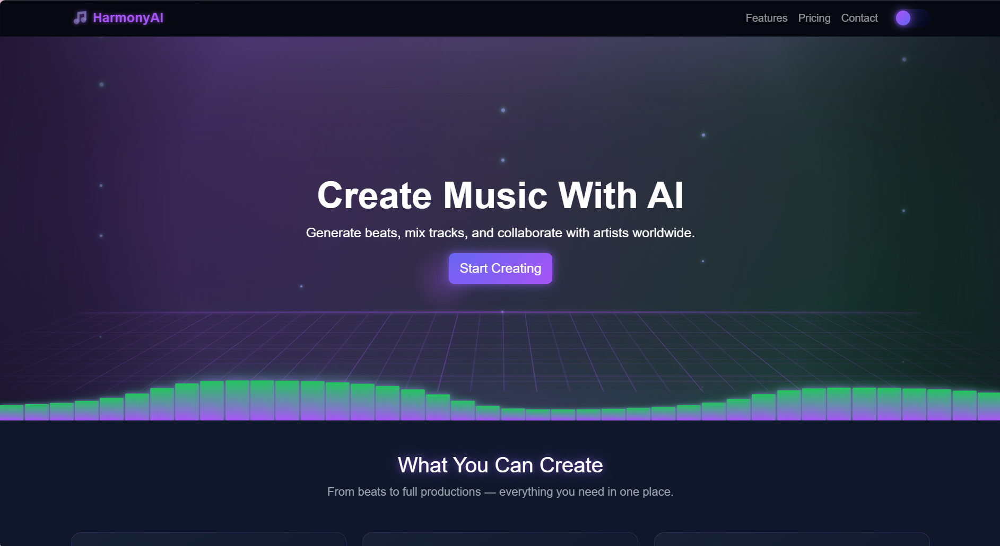

# 🎵 HarmonyAI – AI Music Platform (Frontend)

HarmonyAI is a modern, responsive frontend web application designed for an AI-powered music creation platform. It allows users to explore features like beat generation, cloud mixing, and collaboration in a visually engaging UI.

---

## 🚀 Features

- 🎧 AI Beat Generator UI
- 🎚️ Cloud Mixing Studio Interface
- 🎤 Vocal Enhancement Section
- 📁 Sound Library Showcase
- 🤝 Collaboration Features
- ☁️ Cloud Storage UI
- 💡 Light/Dark Mode Toggle
- ✨ Animated UI (equalizer, particles, glow effects)
- 💳 Pricing Plans Section

---

## 🛠️ Tech Stack

- HTML5  
- CSS3  
- Bootstrap 5  
- JavaScript  

---

## 🎨 UI Highlights

- Neon glow cyberpunk-inspired design
- Smooth animations and transitions
- Interactive theme switching (light/dark mode)
- Glassmorphism-style cards
- Responsive layout for all devices

---

## 📁 Project Structure

```
├── index.html
├── style.css
└── README.md
```

---

## ⚙️ How to Run

1. Download or clone the repository
2. Open the project folder
3. Run `index.html` in your browser

---

## 📸 Preview



---

## 📌 Future Improvements

- Backend integration (Django / Node.js)
- User authentication system
- Real AI music generation APIs
- Audio playback features

---

## 👨‍💻 Author

Meghna Dutta

---

## ⭐ Acknowledgment

This project was created as part of a frontend development project and showcases UI/UX skills with modern web design.